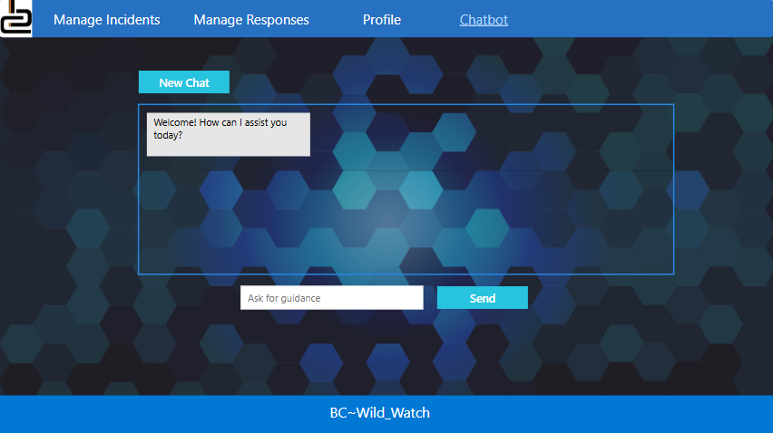
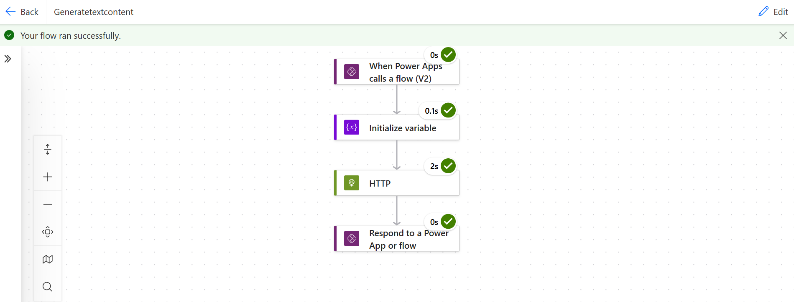
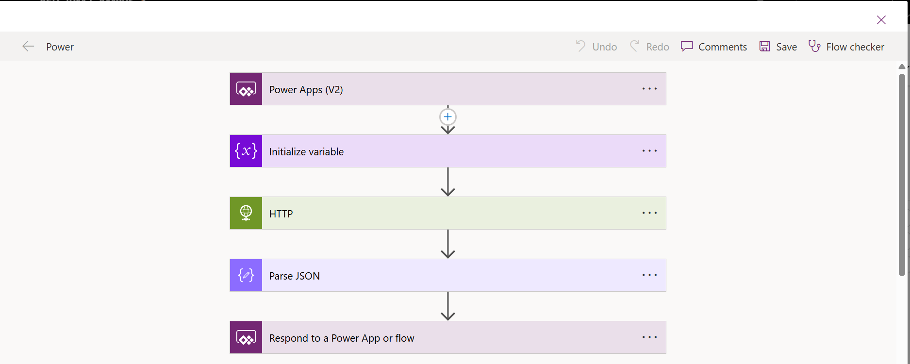

🐾 BC WildWatch™ – Campus Animal Safety Reporting App

Belgium Campus ITversity – INL201 & INL202 Project Milestone 2
Academic Year: 2025

BC WildWatch™ is a campus-wide animal safety reporting system that allows students to quickly report sightings of potentially dangerous or nuisance animals on campus — including snakes, bees, stray dogs, ants, lizards, and more.
The solution integrates Power Apps, SharePoint, Power Automate, Power BI, and an AI Chatbot (Google Gemini) to provide real-time guidance and alerts.

This project was completed by a team of 10 students as part of the Innovation & Leadership module.

📌 Table of Contents

📘 Project Overview

🎯 Goals & Requirements

👨‍💻 My Contribution

🤖 Gemini Chatbot Integration (My Work)

🏗 System Architecture

📸 Screenshots

🚀 How to Run the Solution

🛠 Technologies Used

📄 License

📘 Project Overview

BC WildWatch™ is an innovative reporting system created to keep Belgium Campus students safe by enabling quick reporting and tracking of animal sightings.

The platform provides:

✔ A Power Apps reporting form

✔ A SharePoint List backend for storing reports

✔ Automated alerts to campus security via Power Automate

✔ An AI Chatbot (Gemini) to guide users with safety tips

✔ A Power BI dashboard visualizing incident trends

🎯 Goals & Requirements
Functional Goals

✔ Students must be able to log in and submit sightings
✔ Sightings must be stored in SharePoint / SQL / Excel
✔ Security receives automatic alerts
✔ Admins can view and update incidents
✔ System must include a working AI chatbot
✔ Power BI dashboard must visualize incidents

Minimum Viable Product

Incident reporting form

Gemini/OpenAI chatbot

Power Automate alerts

Power BI dashboard

👨‍💻 My Contribution

I was responsible for the AI portion of the project:

🔥 My Role: AI Chatbot Developer & Integrator

I developed and integrated a Google Gemini 2.5 Flash chatbot directly inside the Power App.
My responsibilities included:

✔ Creating the Gemini API connection

✔ Building a custom Power Automate Flow to call the Gemini model

✔ Parsing JSON responses from Gemini

✔ Returning safe, structured text back to Power Apps

✔ Designing the chat interface (messages, labels, send button)

✔ Implementing chat memory so Gemini sees chat history

This chatbot helps students:

Identify animals

Receive safety tips

Know whether to avoid the area

Get guidance on next steps

🤖 Gemini Chatbot Integration (My Work)

Below is the full documentation of the AI feature I built.

1. Generated API Key

Using Google AI Studio, I created a Gemini API key and stored it securely using an initialized variable (GeminiKey) inside Power Automate.

2. Power Automate Trigger

Trigger: Power Apps
Input: text (the user’s message)

3. HTTP Action (POST → Gemini)
URL:
https://generativelanguage.googleapis.com/v1beta/models/gemini-2.5-flash:generateContent?key=@{variables('GeminiKey')}

Headers:
Content-Type: application/json

Body:
{
  "contents": [
    {
      "parts": [
        {
          "text": "@{triggerBody()['text']}"
        }
      ]
    }
  ]
}

4. Parse JSON Action

Schema:

{
  "type": "object",
  "properties": {
    "candidates": {
      "type": "array",
      "items": {
        "type": "object",
        "properties": {
          "content": {
            "type": "object",
            "properties": {
              "parts": {
                "type": "array",
                "items": {
                  "type": "object",
                  "properties": {
                    "text": { "type": "string" }
                  },
                  "required": ["text"]
                }
              }
            },
            "required": ["parts"]
          }
        }
      }
    }
  }
}

5. Respond to Power Apps

Output: botreply

Expression:

body('HTTP')?['candidates'][0]['content']['parts'][0]['text']

6. Power App Chat UI

Elements:

txtUserInput (Textbox)

lblResponse (Label for chat history)

btnSend (Send button)

OnSelect of btnSend
Set(
    chatHistory,
    chatHistory & "User: " & txtUserInput.Text & Char(10)
);

Set(
    flowResponse,
    Power.Run(chatHistory)
);

Set(
    botReply,
    flowResponse.botreply
);

Set(
    chatHistory,
    chatHistory & "Bot: " & botReply & Char(10)
);

Reset(txtUserInput);

🖼 Chat Interface

🖼 Power Automate Flow

🖼 Chatbot Working Example

🚀 How to Run the Solution
1. Import the Power App

Open Power Apps Studio → Import Canvas App.

2. Configure Data Source

Connect SharePoint List or SQL table for:

Incident Reports

Animal Types

User Profiles

3. Import & Configure Power Automate Flow

Add your own Gemini API key

Update variable GeminiKey

4. Set Up Power BI Dashboard

Load the PBIX file and update datasource connections.

🛠 Technologies Used
Technology	Purpose
Power Apps	Incident reporting and chatbot UI
SharePoint / SQL	Data storage
Power Automate	Alerts + AI API calls
Google Gemini (2.5 Flash)	Chatbot responses
Power BI	Incident analytics dashboards

📄 License

This project was created for educational purposes under Belgium Campus ITversity guidelines.
Not intended for commercial use.
